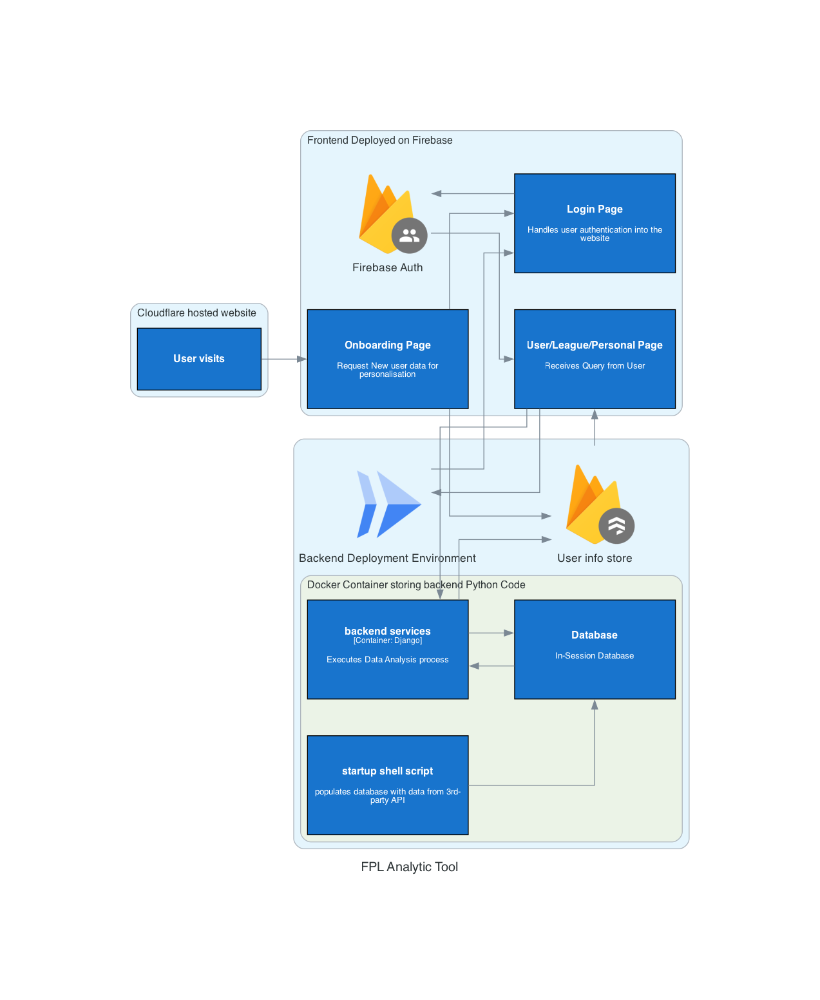
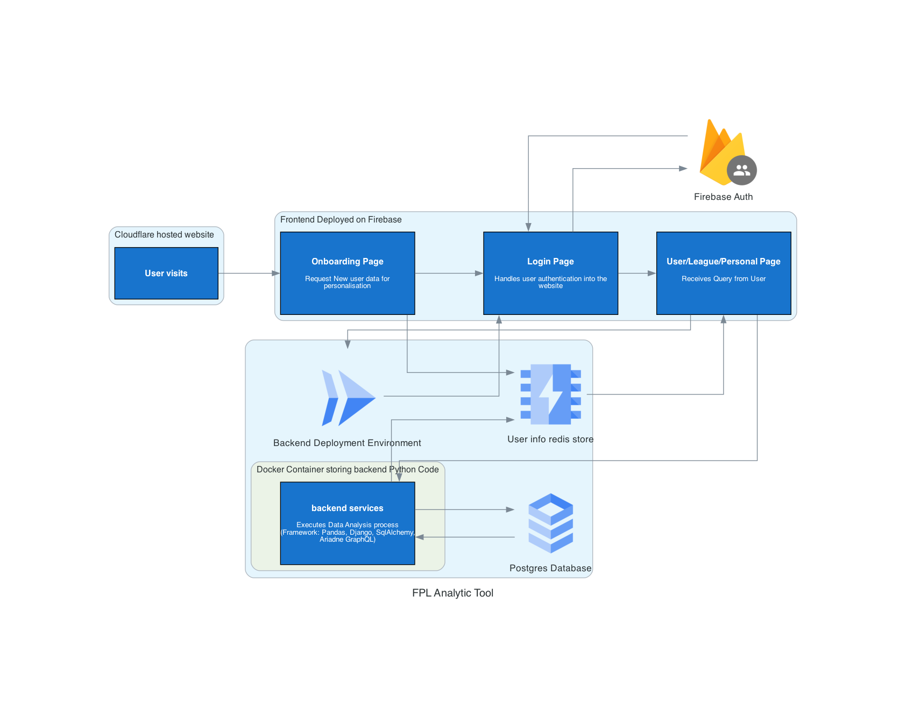

Tools/Frameworks Used: 
- Python,
- Sqlite for database,
- SQAlchemy as ORM, 
- Pandas, Polars for Data Wrangling as Analysis,
- Django + GraphQL to create APIs,
- Pytest to write test,
- Poetry for Environment Management, 
- Github Actions for Continuous Integration and Continuous Deployment
- Docker for Infrastructure Management

### Repo Overview

#### Monolith

#### Decoupled

